# Content Addressable Storage

*Day 1 — the storage primitive everything else sits on.*

## The core idea

In normal storage, **you** pick a name and store data under it. In content-addressable
storage, the **content itself** determines the key. You hash the bytes, and that hash
becomes the address.


No one assigns the name. The content names itself.

## Three properties that fall out

### 1. Deduplication is free

If two different processes produce the exact same file, they hash to the same key.
You store it once.

### 2. Integrity is built in

When you fetch `a1b2c3d4e5...`, re-hash what you got. If it doesn't match,
the data is corrupt. No separate checksum needed.

### 3. Immutability

A given key **always** maps to the same content. Changing one byte produces a
completely different hash. CAS entries are safe to cache forever, replicate freely,
and serve from any tier without worrying about staleness.

```mermaid
graph TD
    subgraph "CAS Properties"
        A["Same content → same hash"] -->|"means"| B["Free dedup"]
        A -->|"means"| C["Built-in integrity"]
        A -->|"means"| D["Safe to cache forever"]
    end
    style A fill:#1a3a1a,stroke:#7ee787
    style B fill:#2d2d2d,stroke:#888
    style C fill:#2d2d2d,stroke:#888
    style D fill:#2d2d2d,stroke:#888
```



## Where you see CAS in the wild

| System | What it stores by content hash |
|--------|-------------------------------|
| **Git** | Every object — blobs, trees, commits. `.git/objects/ab/cdef...` is a CAS with 2-char prefix sharding. |
| **Docker/OCI registries** | Every image layer is a content-addressed blob fetched by SHA-256 digest. |
| **IPFS** | The entire network is a distributed CAS. File address = hash of content. |
| **Nix** | Package store (`/nix/store/`) keys derivations by content hash. |

Git is the most direct analogy — you use it every day and it's doing CAS under the hood.

## The hash function: SHA-256

Build caches typically use SHA-256. A blob is identified by its `(hash, size_bytes)` pair:

```
hash  = "e3b0c44298fc1c149afbf4c8996fb92427ae41e4649b934ca495991b7852b855"
size  = 1048576  (1 MB)
```

The size is included so the cache can allocate buffers and validate transfers
without reading the entire blob first.

## Is hashing expensive?

SHA-256 on modern hardware: **500 MB/s to 1+ GB/s** per core, no special acceleration.

| Operation | Time for 10 MB |
|-----------|---------------|
| SHA-256 hash | ~10-20 ms |
| Read from NVMe SSD | ~2-5 ms |
| Upload to S3 (same region) | ~50-200 ms |
| Download from S3 | ~50-200 ms |

The hash is not free, but it's almost always dwarfed by the network I/O
you're about to do with that blob anyway.

With **SHA hardware extensions** (Intel SHA-NI, ARM SHA2 — most CPUs since ~2018),
throughput jumps to 2-5 GB/s per core. Go's standard library detects and uses these
automatically.

## The streaming trick: hash while sending

You almost never hash first, then send. You do both simultaneously.

Think of a conveyor belt. As each item comes off:

- One observer **counts it** (hash function)
- The same item continues onto the **truck** (network)

Both happen as the item passes by. One pass through the data.

```mermaid
graph LR
    A["bytes in"] --> B["tee / fork"]
    B --> C["hash function"]
    B --> D["network upload"]
    C --> E["final hash"]
    style A fill:#2d2d2d,stroke:#888
    style B fill:#1a3a1a,stroke:#7ee787
    style C fill:#2d2d2d,stroke:#888
    style D fill:#2d2d2d,stroke:#888
    style E fill:#1a3a1a,stroke:#7ee787
```



By the time the last byte hits the network, the hash is already computed.
Total wall-clock time = max(hash time, network time), and network almost always loses.

### Proving it: hash + copy in one pass vs two

```bash
# Create a 50 MB test file
dd if=/dev/urandom of=/tmp/testfile bs=1M count=50 2>/dev/null

# Naive: hash first, then copy (two passes)
time (shasum -a 256 /tmp/testfile > /dev/null && cp /tmp/testfile /tmp/copy1)

# Streaming: hash AND copy simultaneously (one pass)
time (tee /tmp/copy2 < /tmp/testfile | shasum -a 256 > /dev/null)
```

`tee` is the fork — it takes one input stream and splits it into two outputs.
One goes to the file, the other to the hash function. Same bytes, one pass.

### In Go

Go's `hash` package implements `io.Writer`, so it plugs directly into streaming pipelines:

```go
import (
    "crypto/sha256"
    "encoding/hex"
    "io"
)

// Hash a stream in one pass — no buffering the whole thing in memory
h := sha256.New()
io.Copy(h, reader)                      // feeds every byte through the hasher
key := hex.EncodeToString(h.Sum(nil))   // finalize → hex string
```

To hash **while** uploading (the tee pattern):

```go
h := sha256.New()
tee := io.TeeReader(src, h)  // every byte read from tee also feeds into h

// Upload reads from tee — hash is computed as a side effect
uploadToS3(tee)

// By the time upload finishes, hash is ready
key := hex.EncodeToString(h.Sum(nil))
```

### In Python

Same idea — incremental updates, finalize at the end:

```python
import hashlib

h = hashlib.sha256()
for chunk in iter(lambda: f.read(8192), b""):
    h.update(chunk)     # feed chunks as they arrive
key = h.hexdigest()     # finalize
```

## The design constraint

The real cost of CAS isn't compute — it's a **workflow constraint**:

> You can't know the address until you've seen every byte.

This means:

- You can't generate a key upfront and start writing to it
- The client must hash before (or during) upload, then tell the server the hash
- The server should re-verify the hash on receipt to catch corruption

This is a worthwhile trade — you get integrity and dedup for the cost of a
streaming computation that's almost always hidden behind network latency.

## Key takeaway

CAS isn't really a library or a framework — it's a **pattern**. Hash the bytes,
use the hash as the key, store it wherever. The "wherever" is what we're building.
